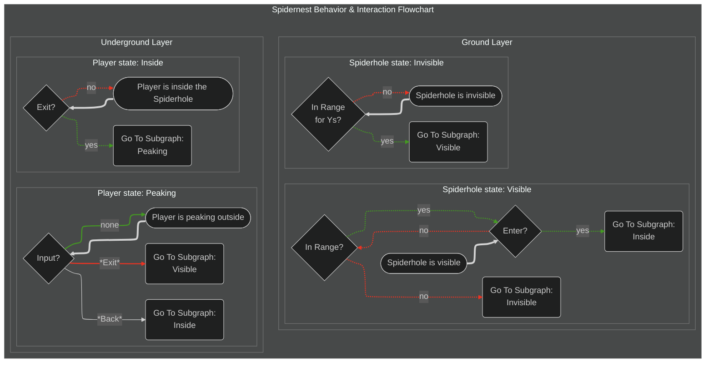

---

| Building Requirements Table | <               | <               | <              | <            | <              | <             |
| --------------------------- | --------------- | --------------- | -------------- | ------------ | -------------- | ------------- |
| **Level**                   | **Set Up Cost** | **Cost/second** | **Build Time** | Max Subrooms | Main Room Size | Hallway Width |
| 0.5 (Set Up)                | none            | none            | none           | n/a          | n/a            | n/a           |
| 1                           | n/a             |                 |                | 0            | 1x2            | n/a           |
| 2                           | n/a             |                 |                | 1            | 2x3            | 1             |
| 3                           | n/a             |                 |                | 2            | 3x4            | 2             |
| 4                           | n/a             |                 |                | 4            | 3x4            | 2             |
- Build Access: Sabotage Corps (default),  Scout Corps (default)

- **Ground Layer:** Inconspicuous pile of leaves. The sprite automatically changes to a color variation that blends with the environment. It is small, can be easily obscured, and is invisible to players far away.
- **Underground Layer:** A makeshift dirt bunker using bushcraft. Lantern, wooden support beams, crates, some military gear and equipment scattered.

## Technical Interaction Behavior

- **Collision**: The 'Hole' has no collision, a player can walk right through it and not realize it
- **Enter Nest:** `Interact` with the entrance to fade the screen to black >> despawns the player >> spawns the player on the underground layer next to the exit >> screen fades back out
- **'Sneaky Peak':** `Interact` with the exit to fade the screen to black >> screen fades back out on the **Ground** Layer >> The 'Hole Cover' sprite subtly changes to an ajar/lifted position to indicate someone is peaking
- **Exit Nest:** While in the Sneaky Peak state, `Interact` again to instantly teleport to the **Ground** Layer next to the entrance
- **Stop 'Sneaky Peak'**: While in the Sneaky Peak state, `Cancel` to fade in and out back to the player character

