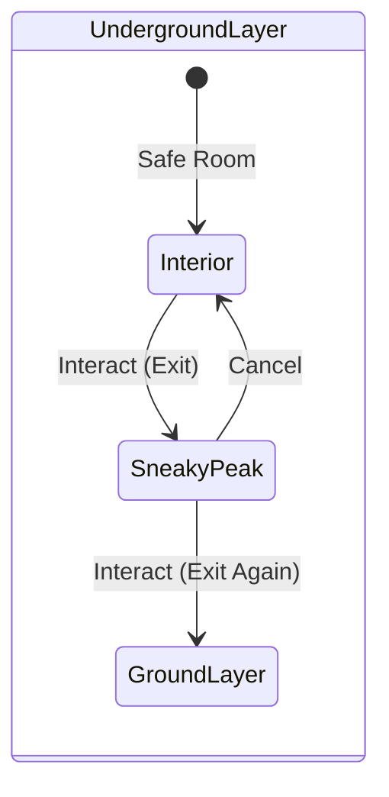
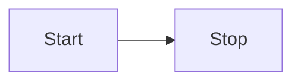
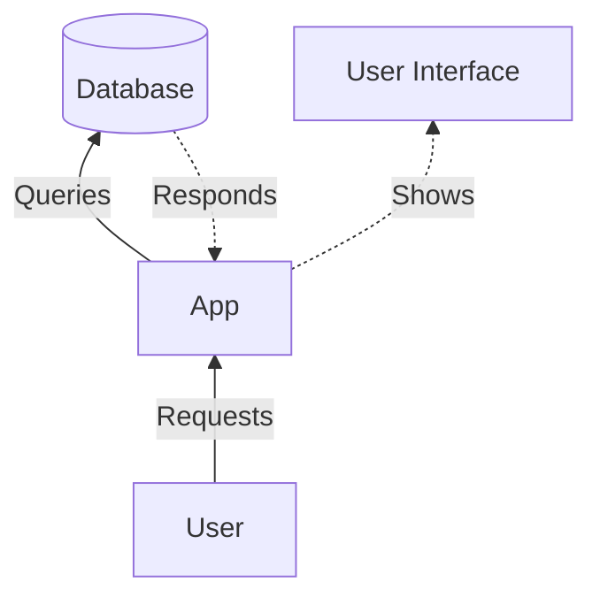

---
{"dg-publish":true,"permalink":"/immune-defense/buildings/dynamic-buildings/spider-nest-specs/","dg-note-properties":{"icon":"file-text","showTimestamps":true,"showReadingTime":true}}
---

# Spider Nest Specs

_ _ _ _ __

## Design Intent

| Use Case Evolution |
| --- |
| **Short Term**: An accessible refuge to catch their breath and take vulnerable actions that would otherwise expose them. |
| **Medium Term**: Multiple players can access the spider nest. Resources can be stored for players to resupply, allowing shorter downtime and sustaining backline operations. |
| **Long Term**: A developed spider nest can eventually be connected to other nearby nests, creating an underground network for mass covert mobilization, supply transportation, and operation. |

| Balance |
| --- |
| **Strength**: Enabling sustained presence in enemy territory can greatly increases the effectiveness of Saboteur and Scout operations and survivability. Over an extended periods of time, this value can compound to the point that it's influence enables an alternate & unconventional win approach. |
| **Weakness**: A spider nests only safetynet is it's secrecy. If the enemy is aware of it's location, they have an overwhelming advantage against players that are currently inside it. They can invade and take over the nest, or destroy the nest and anyone inside it with ease. |

> [!note]- Design Note
> Spider nests allows role design space to delegate certain classes (or allow players with certain playstyle to "volunteer") to serve as the "bug catchers" of the team. Where they consistently maintain this threat under control. This shows similarities to the "pybro" emergent playstyle from Team Fortress 2.
>
> *In TF2, Pyro is a class that uses a flamethrower, a weapon that "hit-scans" a large amount of area. Often the best class to check for invisible enemy Spies, with experienced players turning this into an unwritten sub-responsibility within their team. "Pybros" (as in Pyro bro) goes a step further and sticks by their team Engineer and their buildings, a primary target for Spies. Dedicating their play time checking and eliminating Spies as well as saving buildings by removing their 'sappers' with a dedicated melee weapon they can equip.*

## Visual & Layout

- **Ground Layer:** Inconspicuous pile of leaves. The sprite automatically changes to a color variation that blends with the environment. It is small, can be easily obscured, and is invisible to players far away.
- **Underground Layer:** A makeshift dirt bunker using bushcraft. Lantern, wooden support beams, crates, some military gear and equipment scattered.

## Technical Interaction Behavior

- **Collision**: The 'Hole' has no collision, a player can walk right through it and not realize it
- **Enter Nest:** `Interact` with the entrance to fade the screen to black >> despawns the player >> spawns the player on the underground layer next to the exit >> screen fades back out
- **'Sneaky Peak':** `Interact` with the exit to fade the screen to black >> screen fades back out on the **Ground** Layer >> The 'Hole Cover' sprite subtly changes to an ajar/lifted position to indicate someone is peaking
- **Exit Nest:** While in the Sneaky Peak state, `Interact` again to instantly teleport to the **Ground** Layer next to the entrance
- **Stop 'Sneaky Peak'**: While in the Sneaky Peak state, `Cancel` to fade in and out back to the player character

## Deployment & Levels

- Build Access: Sabotage Corps (default),  Scout Corps (default)

| Building Requirements Table | < | < | < | < | < | < |
| --- | --- | --- | --- | --- | --- | --- |
| **Level** | **Set Up Cost** | **Cost/second** | **Build Time** | Max Subrooms | Main Room Size | Hallway Width |
| 0.5 (Set Up) | none | none | none | n/a | n/a | n/a |
| 1 | n/a | | | 0 | 1x2 | n/a |
| 2 | n/a | | | 1 | 2x3 | 1 |
| 3 | n/a | | | 2 | 3x4 | 2 |
| 4 | n/a | | | 4 | 3x4 | 2 |

| Upgrades Table | < | < | < |
| --- | --- | --- | --- |
| **Name** | Type | Description | Restrictions |
| Reinforced | Room | +Minus X% Cave In Chance | |
| Secret Exit | Subroom | - New interactable exit object. - X00% longer interaction time, Sneaky Peak is still enabled. - Interacting teleports player to a random location in the Ground Layer X meters away from the Nest | |
| Commune | Main Room | - Allow up to 3 other allies to occupy the Nest. - Allow Hive Tunnels to be connected to the Nest | |
| Storage | Subroom | - Creates HP and Ammo globs storing interactable | |
| Storage 2 | Storage | | |
| Hive Tunnel | Subroom | - Creates a narrow tunnel that connects to another Nest if it's within X meters away. - Tunnel has property: 'tight space' | - Pioneer Subclass. - 'Commune' Upgrade. - Nest within X meters |
| Hive Tunnel 2 | Hive Tunnel | | Level 4 |
| Empty Room | | | |

## Additional Rules

- **Hidden:** Player must be within 3 meters of the 'Hole' for 3 seconds before the entrance is highlighted and becomes interactable.
- **Grenade Drop**: When a player `Alt-Interact` the 'Hole Cover' while holding a grenade, they use-up the grenade and spawn a live grenade in the hole.
- **Underground**:
- **Dibs** & **Anti-Idling:** When a player creates a Nest, they have 'Dibs' on that particular one. Only they can access the Nest while they have 'Dibs'
  - This rule is ignored if they choose to unlock the 'Commune' upgrade.
  - The player loses 'Dibs' and 'Commune' upgrade is automatically unlocked if:
    - X minutes passes by. Timer has 2x speed while Nest is not in use after Y seconds (as buffer).
    - The player is flagged as 'Idling' inside their Nest after Z seconds and a visual warning.

